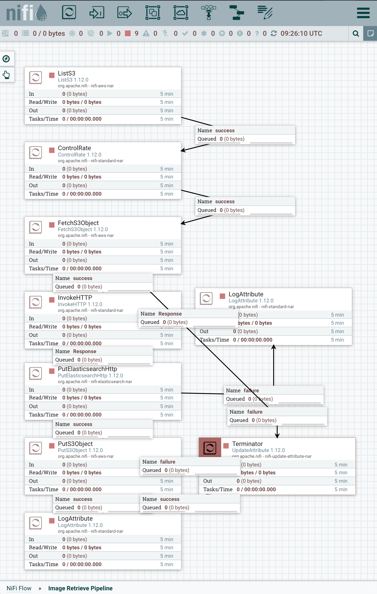

# Image pipeline

Simple showcasing for annotating DICOM and non-DICOM images using Deep learning and Data Lake technologies

## Run
- docker-compose up -d

## Publication 
[Poster](https://mi-ki.eu/wp-content/uploads/2022/06/Image_Retrieve_Poster_Cheng.pdf)