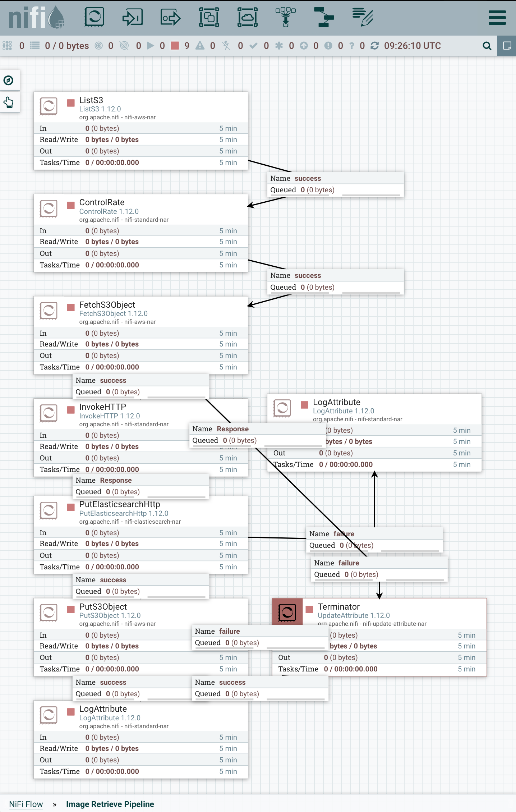
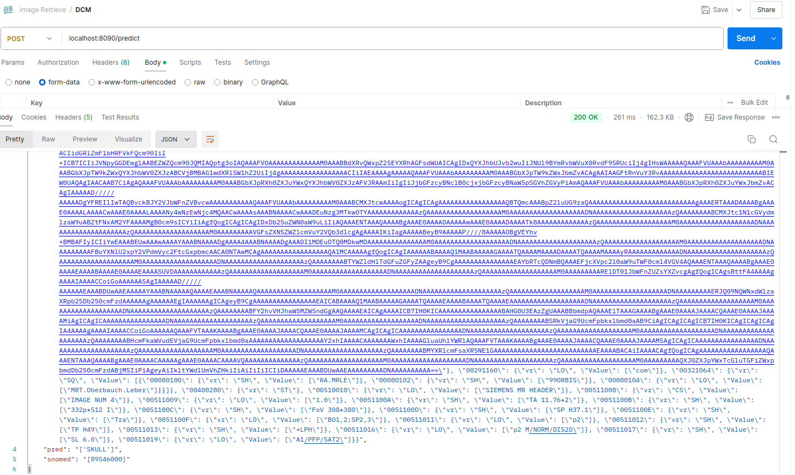

# Automated image pipeline for DICOM and non-DICOM images
Simple showcasing for annotating DICOM and non-DICOM images using Deep learning and Data Lake technologies

## Run
```
# Download model from Zenodo[https://zenodo.org/records/13767337] and edit the corresponding checkpoint path in `flask/app.py` 
docker-compose up -d
```  
Our method can be run using the following instance in docker-compose.yml:
+ S3
+ Nifi
  
+ Elasticsearch
+ `flask/app.py`: Our flask server (DICOM Reader & Deep learning model)

## Test annotate DICOM or PNG
1) import flask/archieve/Image Retrieve.postman_collection.json to Postman[https://www.postman.com/downloads/]
   
2) open flask/send-dicom-requests.ipynb and flask/send-png-requests.ipynb with Jupyter notebook

---------
## Contact
Ka Yung Cheng - mail@kayungcheng.de

## Publication 
[Journal] (https://www.csbj.org/article/S2001-0370(24)00203-4/fulltext)
```
@article{article,
author = {Cheng, Ka and Lange-Hegermann, Markus and Hövener, Jan-Bernd and Schreiweis, Björn},
year = {2024},
month = {06},
pages = {},
title = {Instance-level Medical Image Classification for Text-based Retrieval in a Medical Data Integration Center},
volume = {24},
journal = {Computational and Structural Biotechnology Journal},
doi = {10.1016/j.csbj.2024.06.006}
}
```
The ROCO dataset in Experiment I can be obtained from a public repository at [https://github.com/razorx89/roco-dataset], while the IRMA2007 dataset in Experiment II is available at [http://publications.rwth-aachen.de/]. Additionally, the customized SNOMED dataset utilized in Experiment III is accessible through the following URL: [https://doi.org/10.57892/100-29] and the UNIFESP dataset can be accessed through Kaggle at [https://www.kaggle.com/datasets/felipekitamura/unifesp-xray-bodypart-classification]

[Poster](https://mi-ki.eu/wp-content/uploads/2022/06/Image_Retrieve_Poster_Cheng.pdf)
```
@article{article,
author = {Cheng, Ka and Pazmino, Santiago and Bergh, Björn and Lange-Hegermann, Markus and Schreiweis, Björn},
year = {2024},
month = {01},
pages = {1388-1389},
title = {An Image Retrieval Pipeline in a Medical Data Integration Center},
volume = {310},
isbn = {9781643684567},
journal = {Studies in health technology and informatics},
doi = {10.3233/SHTI231208}
}
```
